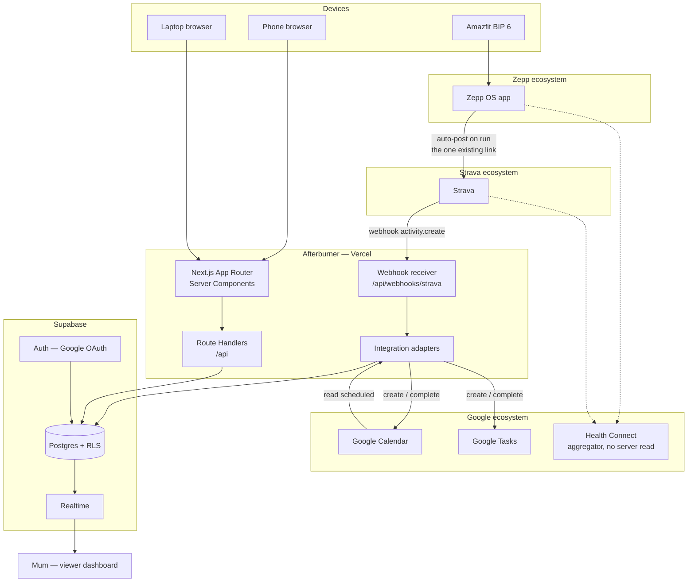
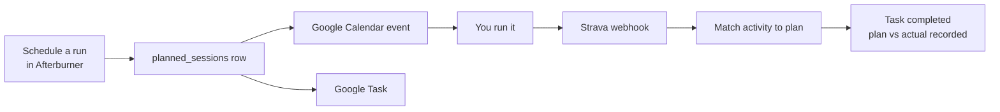
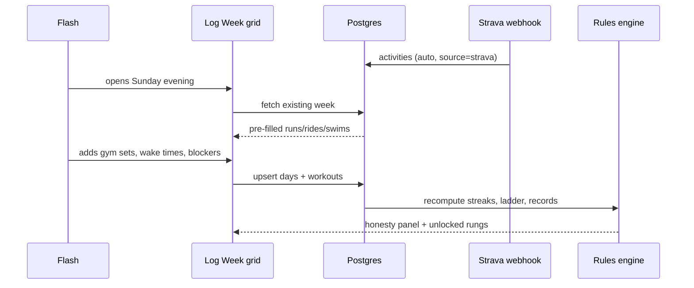

# Afterburner — Architecture & Build Plan

Personal multi-sport training system.
Owner: Flash (Vinayak Mishra)
Repo: `afterburner`

---

## 1. What this is

A single dashboard for running, cycling, swimming, gym and body metrics, with a discipline layer (wake time, sleep time) and a checkpoint-based achievement ladder.

**The problem it solves:** Strava is session-oriented, Healthify is nutrition, Zepp is a silo. Nothing answers *"what did this week look like across all of it, and am I trending the right way."*

**Design constraints, in priority order:**
1. Data must never be lost. Durability beats every other feature.
2. A full week must be loggable in ten minutes, at the weekend, from phone or laptop.
3. Honest feedback, not encouragement.
4. Free infrastructure.
5. Single-user today, multi-tenant-ready from day one.

**Confirmed decisions:**
| Question | Answer |
|---|---|
| Name | Afterburner |
| First integration | Strava |
| Gym logging | Full depth — planned vs actual, per set |
| Wake target | 07:00 |
| Ladder | Seeded list + custom additions |

---

## 2. System architecture



**Three independent ecosystems.** Zepp holds watch data. Strava holds activities. Google holds the schedule. Health Connect aggregates from all of them on-device, but it is Android-only with no server-side read, so it sits outside Afterburner's data path entirely — shown dotted for completeness only.

**The one link that exists today:** logging a run on the watch auto-creates a Strava post. That is the whole of the current integration surface, and it is enough — Strava is Afterburner's inbound pipe for every activity.

**Google is bidirectional.** Afterburner writes to Calendar and Tasks as well as reading from them, so training is scheduled *from* the platform rather than duplicated into it.

**Request flow, plain language:** you log a week in the browser; Server Components read straight from Postgres with row-level security doing authorisation. Strava pushes activities to a webhook, which normalises them through an adapter into the same `activities` table your manual entries land in. Mum's dashboard subscribes to Realtime and updates without a refresh.

### The planning loop



This mirrors the gym model in §6: prescribe, perform, compare. For endurance work the prescription comes from you rather than a trainer, and the comparison is automatic because Strava reports the actual.

### Data flow for one logged week



The point of the Strava-first ordering: by the time you open the form, the running and cycling rows are already filled. You are only typing what no sensor can capture — gym sets, wake times, and why a day went wrong.

---

## 3. Stack

| Layer | Choice | Why |
|---|---|---|
| Framework | Next.js (App Router) | One repo for UI and API routes |
| Hosting | Vercel | Free, git-push deploys |
| Database | Supabase Postgres | Free, real SQL, row-level security |
| Auth | Supabase Auth (Google) | Same OAuth you extend for Tasks/Calendar |
| Realtime | Supabase Realtime | Mum's dashboard updates live |
| Charts | Recharts | Simple, sufficient |
| CI | GitHub Actions | Lint, typecheck, build, migration check |

**Verify before building:** Supabase free-tier projects pause after a period of inactivity. With weekend-only logging you may sit near that boundary. Mitigate with a scheduled GitHub Action pinging a health endpoint every few days.

---

## 4. Information architecture

```
/                  Panel         — the dashboard
/log               Log Week      — the 7-day entry grid
/running           Running
/cycling           Cycling
/swimming          Swimming
/gym               Gym & Yoga
/body              Body          — weight + bio-scan trend
/goals             Ladder        — achievements, races, streaks
/tasks             Today         — Google Tasks (phase 4)
/share/[token]     Viewer        — read-only, for Mum
```

**Panel contains:** contribution grid (one cell per day, shaded by volume) · this week vs last week · weight trend · wake-time trend with target band · active streaks, current and best · next race with countdown and gap-to-goal · honesty panel.

**Sport tabs each contain:** session list, distance/pace trend, PR table, streak status.

---

## 5. Data model

Core decision: **days are the unit of storage, weeks are the unit of entry.** Weekly aggregates would discard which specific days fail, which is the pattern most worth seeing.

```sql
profiles
  id uuid pk → auth.users
  display_name text
  height_cm int
  wake_target time default '07:00'
  timezone text default 'Asia/Kolkata'

days                        -- one row per user per calendar date
  id uuid pk
  user_id uuid fk
  date date
  wake_time time null
  sleep_time time null      -- clock time; Zepp owns duration
  blocker_code text null
  blocker_note text null
  notes text null
  unique (user_id, date)

activities                  -- one session; a day may have several
  id uuid pk
  user_id uuid fk
  date date
  sport text                -- run | ride | swim | gym | yoga | other
  distance_m int null
  duration_s int null
  avg_pace_s_per_km int null
  perceived_effort int null -- 1-5, optional
  source text               -- manual | strava
  external_id text null     -- dedupe key for imports
  notes text null
  unique (user_id, source, external_id)

body_metrics
  id uuid pk
  user_id uuid fk
  date date
  weight_kg numeric
  bio_score numeric null    -- Amazfit overall score
  unique (user_id, date)

records                     -- PRs
  id uuid pk
  user_id uuid fk
  sport text
  metric text               -- 1k | 5k | 10k | half | longest | best_pace
  value numeric
  unit text
  achieved_on date
  activity_id uuid null fk

planned_sessions            -- training you schedule from Afterburner
  id uuid pk
  user_id uuid fk
  scheduled_for timestamptz
  sport text                -- run | ride | swim | gym
  target_distance_m int null
  target_pace_s_per_km int null
  target_note text null     -- "easy 5k", "intervals 5x3min"
  plan_id uuid null fk      -- for gym, links to a trainer plan
  google_event_id text null -- Calendar event we created
  google_task_id text null  -- Task we created
  matched_activity_id uuid null fk
  status text               -- scheduled | done | missed | cancelled
  missed_reason text null   -- reuses blocker_code vocabulary

races
  id uuid pk
  user_id uuid fk
  name text
  sport text
  distance_m int
  race_date date
  goal_value numeric null   -- target time, seconds
  status text               -- planned | registered | done

achievements
  id uuid pk
  user_id uuid fk
  name text
  category text             -- discipline | run | ride | swim | gym | body
  rung int
  rule_json jsonb null      -- non-null = auto-computed
  unlocked_at timestamptz null
  is_custom bool default false

streaks
  id uuid pk
  user_id uuid fk
  discipline text           -- wake | run | gym | ride | swim
  target_per_week int
  current_weeks int
  best_weeks int
  pause_tokens_remaining int default 2
  active bool default true

integrations                -- see §8
  id uuid pk
  user_id uuid fk
  provider text             -- strava | google | (future)
  access_token text
  refresh_token text
  expires_at timestamptz
  scopes text[]
  external_user_id text
  unique (user_id, provider)

shares
  id uuid pk
  owner_id uuid fk
  token text unique
  scope text                -- summary | full
  revoked bool default false

comments
  id uuid pk
  share_id uuid fk
  author_name text
  body text
  created_at timestamptz
```

**Blocker codes** (dropdown, plus free text):
`work_ran_late` · `slept_late` · `woke_late` · `unwell` · `rain` ·
`travel` · `itf_event` · `social` · `scrolling` · `no_energy` ·
`gym_crowded` · `other`

This is the highest-value data in the system. After three months it tells you with evidence what actually stops you, and it's the input for the AI layer in phase 5.

**Row-level security:** enable RLS on every table from day one. `user_id = auth.uid()` for owner access, a separate policy for share-token reads. Retrofitting RLS after a viewer dashboard exists is painful.

---

## 6. Gym logging — modelled on how you already log

Your handwritten logs have a consistent shape: **the trainer prescribes a session, then you record what actually happened.** That gap is the most useful signal in the whole app, so the schema stores both sides.

Worked example from your 7th session:

| | Prescribed | Actual |
|---|---|---|
| Machine chest press | 3×10 max weight | 3×10 @ 15 kg/side |
| Incline barbell press | 3×12 | 3×12 @ 30 kg total |
| Plyo push-ups | 10×10 | 6 total |
| Push press | 3×12 | 1×12 @ 30 kg, 2×12 @ 20 kg |
| Bench dips | 3×12 add weight | 12 @ 0 kg, 12 @ 5 kg, 12 @ 10 kg |

Three things this reveals that a "session done" checkbox would lose: the plyo push-up collapse, the push-press weight drop mid-session, and the bench-dip ladder. All three are progression data.

```sql
plans                       -- a trainer-prescribed session template
  id uuid pk
  user_id uuid fk
  name text                 -- "7th session", "Push day"
  focus text                -- chest | legs | pull | conditioning
  archived bool default false

plan_items
  id uuid pk
  plan_id uuid fk
  position int
  exercise text
  prescribed_sets int null
  prescribed_reps int null
  prescribed_load_kg numeric null
  prescribed_note text null -- "maximum weight", "add more weight"

sets                        -- one row per performed set
  id uuid pk
  activity_id uuid fk       -- the gym activity for that day
  plan_item_id uuid null fk -- null = unplanned / improvised
  exercise text
  set_number int
  reps int                  -- 0 records an attempted-and-failed set
  load_kg numeric null
  load_mode text            -- total | per_hand | per_side | bodyweight
  note text null
```

**`load_mode` matters.** Your logs mix "15kg each hand", "5kg each side so total 30kg", and bare totals. Storing the raw number plus the mode means the app can normalise to true total load for progression charts without you changing how you think about it.

**`reps = 0` is meaningful,** not missing data. "Dips — not able to do any" is exactly the kind of entry that later becomes the first-dip achievement unlock.

**Warm-up cardio inside a gym session** (your treadmill intervals, the 15-minute bike) goes in `activities` as its own row, not in `sets`. A gym day can hold two activities.

**Entry speed:** pick the plan, and the grid pre-fills every prescribed set. You only touch the numbers that differed. That keeps a full session under ninety seconds despite the depth.

---

## 7. Streaks

**Unit: the week.** A week is green if the discipline's target is met.

| Discipline | Target | Active now? |
|---|---|---|
| Wake time | 5 of 7 mornings at or before 07:00 | Yes |
| Running | 2 sessions | Yes |
| Gym | 3 sessions | Yes |
| Cycling | 1 ride | No — activate on bike purchase |
| Swimming | 1 session | No — activate on membership |

**Pause tokens:** two per calendar month, applied retroactively at logging time. A paused week neither advances nor breaks the chain. Illness, rain, genuinely impossible weeks.

**On break:** current resets, best is preserved and shown alongside. The app never displays only the loss.

Weekly rather than daily is deliberate: a daily chain offers 365 chances a year to fail, and you've described how you respond to a broken chain. A weekly chain with pause tokens only breaks on sustained drift, which is the only signal worth reacting to.

---

## 8. Integrations — the adapter pattern

Every external source normalises into `activities` through a common interface. Adding a provider later means writing one adapter, not touching the schema.

```mermaid
graph LR
    ST[Strava] --> A1[StravaAdapter]
    GT[Google Tasks] --> A2[GoogleAdapter]
    FU[Garmin / Whoop / Oura<br/>future] -.-> A3[Adapter]
    A1 --> N[normalise&#40;&#41; → Activity]
    A2 --> N
    A3 -.-> N
    N --> DB[(activities)]
```



```ts
interface ActivityProvider {
  authorize(userId: string): Promise<AuthUrl>
  exchangeCode(code: string): Promise<Tokens>
  refresh(tokens: Tokens): Promise<Tokens>
  handleWebhook(payload: unknown): Promise<NormalisedActivity[]>
  backfill(since: Date): Promise<NormalisedActivity[]>
}
```

**Strava — inbound only (phase 4, first).** OAuth, then a webhook subscription. On `activity.create`, fetch the detail and insert with `source='strava'` and `external_id`. Covers run, ride and swim automatically.
Chain: watch → Zepp → Strava (existing auto-post) → webhook → Afterburner.
Afterburner never writes to Strava.

**Google Calendar + Tasks — bidirectional (phase 4, second).** Same Google OAuth as login, additional scopes.

*Outbound (the important half):* scheduling a session in Afterburner creates a Calendar event and a Task, storing `google_event_id` and `google_task_id` on the `planned_sessions` row. This is what makes Afterburner the place you plan training, rather than another place you re-type it.

*Inbound:* read back scheduled sessions so the Panel shows what's coming, and mark the Task complete once a matching activity lands.

Keep the scope narrow to training. General day-to-day task management stays in Google Tasks proper — resist letting the Today tab grow into a to-do app.

**Health Connect — not in the data path.** It aggregates Zepp, Strava and Google Fit on-device, but it is Android-only with no server-side read API, so Afterburner cannot pull from it. Everything needed arrives via Strava instead. Sleep duration and detailed metrics stay in Zepp; Afterburner stores wake and sleep *clock times* only, entered manually.

**Plan-to-actual matching.** When a Strava activity arrives, look for a `planned_sessions` row with the same user, same sport, and `scheduled_for` within ±12 hours that is still `scheduled`. On a match: set `matched_activity_id`, set `status='done'`, complete the Google Task. On no match, the activity still lands normally as unplanned training. Unmatched plans older than 24 hours flip to `missed` and prompt for a `missed_reason` at logging time — which is where the blocker data comes from without you having to remember it.

**Dedupe rule, write it before enabling webhooks:** the unique constraint on `(user_id, source, external_id)` prevents duplicate imports. For a same-day, same-sport collision between manual and imported, imported wins on the numeric fields and manual notes are preserved. Reconciliation logic written after webhooks are live is how you end up with a duplicated month.

---

## 9. Scalability

Single-user today, but nothing here needs rewriting to serve others.

**Multi-tenancy is already done.** Every table carries `user_id` and RLS enforces isolation in the database rather than the application. Adding users requires zero schema change and zero new authorisation code — this is the single most important architectural decision in the project, and the one worth writing about in the README.

**Stateless compute.** Next.js on Vercel scales horizontally by default. No session affinity, no in-process state. Nothing to change under load.

**Read-heavy by nature.** The Panel is read many times per write. When row counts grow, add materialised views for weekly rollups and refresh on write. Don't build this now — it's premature at one user — but keep aggregation logic in SQL rather than TypeScript so the migration path stays open.

**Webhook ingestion.** Currently synchronous, which is fine at your volume. At scale the receiver should acknowledge immediately and enqueue, so a slow Strava fetch can't time out the webhook and trigger retries. Structure the handler as `validate → enqueue → process` from the start, even while the queue is a direct function call.

**Where the free tier breaks.** Supabase free covers roughly 500 MB of database and 50k monthly active users; Vercel free covers 100 GB of bandwidth. Your data is a few hundred rows a year — you would hit those limits somewhere around a thousand active users, well past the point where charging for it makes sense.

**What actually blocks multi-user later:** anything that assumes a single user. Avoid hardcoded IDs, avoid global caches keyed by nothing, avoid server components that fetch without a user filter. RLS will catch most of it, but caching is where the leaks happen.

**Extension surface.** New sport → a `sport` enum value plus a tab. New device → one adapter. New achievement → a row in `achievements` with a `rule_json`. New viewer → a row in `shares`. None of these require a migration, which is the test of whether the model is right.

**If Health Connect ever exposes a server API,** or you move to a device with a direct API, it slots in as another `ActivityProvider` behind the same interface. Nothing above the adapter layer changes. That is the point of §8.

---

## 10. Achievement ladder

Seeded list plus custom additions (`is_custom`). `rule_json` non-null means auto-computed; null means you tick it yourself.

| # | Rung | Category | Auto? |
|---|---|---|---|
| 1 | Log four consecutive weeks | discipline | Yes |
| 2 | Wake by 07:00 on 5 of 7 days, one week | discipline | Yes |
| 3 | Three gym sessions in one week | gym | Yes |
| 4 | Four straight weeks of 5-of-7 mornings | discipline | Yes |
| 5 | Run 20 km in a single week | run | Yes |
| 6 | First unassisted dip | gym | Yes — first `reps > 0` on dips |
| 7 | 10 plyo push-ups in one set | gym | Yes |
| 8 | 5K under 22:00 | run | Yes |
| 9 | First 50 km ride | ride | Yes |
| 10 | 5K under 20:00 | run | Yes |

Rungs 1 and 2 are clearable inside two weeks by design — a ladder that doesn't pay out early stops functioning as motivation.

**Display:** current rung per category plus the next locked one. Not the whole board.

---

## 11. The honesty panel

Rules-based on the Panel. Not an LLM in v1 — deterministic rules are debuggable and free.

- Runs < 2 this week → *"Two runs. That was the number. It isn't a hard number."*
- Wake time drifting later three weeks running → *"Your wake time has slipped 40 minutes over three weeks. This is the thing everything else depends on."*
- `scrolling` logged 3+ times → *"Scrolling was the reason three times this week. Is fitness the choice, or is one more reel?"*
- Weight down and gym volume down together → *"Weight is dropping while training volume falls. That's muscle leaving, not fat."*
- Prescribed vs actual gap > 30% for two sessions → *"You're finishing 60% of what's programmed. Either the programme is wrong or the effort is."*

Show at most two at a time, worst first. One encouraging line only when a streak extends or a PR lands.

---

## 12. Build phases

**Phase 0 — tonight, ~3 hours, personal laptop.** Deploy empty first, then make it work.
1. Repo, Next.js scaffold, push, connect Vercel, confirm a live URL
2. Supabase project, Google auth, login and logout working
3. Migration for `profiles`, `days`, `activities`, `body_metrics` — with RLS
4. One form: log a single day
5. One view: last 30 days

Deploy at each step. Ending the night with a live URL holding one real day is the entire goal. It does not need to look like anything.

**Phase 1 — three weeks, no code.** Log daily. Change nothing. Note what you skip and what's missing.

**Phase 2 — a weekend.** The 7-day grid. Panel with contribution grid and trends. Sport tabs.

**Phase 3 — an evening.** Plans and sets (§6). Streaks, pause tokens, ladder, races with gap-to-goal, honesty panel.

**Phase 4 — a weekend.** Strava OAuth and webhooks. Google Calendar and Tasks write-back, `planned_sessions`, plan-to-actual matching. Share tokens, viewer dashboard, realtime, comments. GitHub Actions CI.

**Phase 5 — later.** LLM layer over the blocker history.

---

## 13. Portfolio notes

A fitness CRUD app is the most common junior project in existence. What makes this one worth attention is in §8 and §9:

- Webhook ingestion with idempotency and dedupe reconciliation
- OAuth token storage and refresh handled correctly
- Row-level security as the authorisation model rather than app-layer checks
- Provider adapter pattern with a documented extension path
- Realtime subscriptions for the shared dashboard
- CI with typecheck and migration validation

Write the README around **those decisions and their trade-offs**, not around features. Include the mermaid diagrams from §2 and a short "why Postgres RLS instead of API-layer authorisation" section. That reads as engineering judgement, which is what you're being hired for.

---

## 14. Working with Claude Code

You want to understand every line without hand-writing it. That requires an explicit instruction, because the default is a large silent dump.

`CLAUDE.md` at the repo root:

```
Work in small, reviewable increments. One concern per commit.
Before writing code for a new module, state the approach in 3-4 lines
and wait for confirmation.
After each file, explain in plain language what it does and why this
approach over the obvious alternative.
Never introduce a library without saying what it replaces and why.
No placeholder or TODO code — if something can't be built yet, say so.
Enable RLS on every table in the same migration that creates it.
```

Work module by module: auth, then schema, then one form. Review each before moving on. Letting it build all of phase 0 in one shot produces a working app you don't understand, which defeats both of your stated goals.

---

## 15. Tonight's checklist

- [ ] Personal laptop, not the work machine
- [ ] `npx create-next-app@latest afterburner` — TypeScript, Tailwind, App Router
- [ ] Push to a private GitHub repo
- [ ] Import to Vercel, confirm the live URL loads
- [ ] Create Supabase project, note the URL and anon key
- [ ] Google OAuth configured, login works end to end
- [ ] First migration applied, RLS on
- [ ] Log one real day
- [ ] Deployed and reachable from your phone

---

## 16. Design system

Reference: monkeytype's dark theme. What makes it work is not the colour — it's the card pattern (small muted label above, large mono number below), heavy negative space, and **one accent doing all the work**. Reproduce that discipline before reproducing the palette.

### Rule: one base, many accents

The background and surfaces never change. Only `--accent` rebinds per route. Changing the base per sport makes it read as five apps rather than one.

```css
:root {
  --bg:          #0A0F14;
  --surface:     #121A22;
  --surface-2:   #19232D;
  --border:      #1F2C38;
  --text:        #E3E8EE;
  --text-muted:  #5C6B7A;

  --accent:      #8FA3B8;   /* default, overridden per route */
}

[data-sport="run"]        { --accent: #FF7A45; }
[data-sport="ride"]       { --accent: #E0413C; }
[data-sport="swim"]       { --accent: #4ECDC4; }
[data-sport="gym"]        { --accent: #A78BFA; }
[data-sport="body"]       { --accent: #8FA3B8; }
[data-sport="discipline"] { --accent: #F5C542; }
```

Set `data-sport` on the route's layout wrapper. Every component reads `var(--accent)` and needs no per-sport logic.

### The Panel has no accent of its own

It's the only page where all six colours appear together, so it does not introduce a seventh. Each card carries its own sport's accent in its sparkline; the overview contribution grid uses a neutral ramp so it doesn't imply a sport.

### Contribution grid

Five steps from surface to full accent. Per-sport tabs use that sport's ramp; the overview uses neutral.

```css
--grid-0: var(--surface);
--grid-1: color-mix(in srgb, var(--accent) 20%, var(--surface));
--grid-2: color-mix(in srgb, var(--accent) 40%, var(--surface));
--grid-3: color-mix(in srgb, var(--accent) 65%, var(--surface));
--grid-4: var(--accent);
```

### The card pattern

Every metric follows one shape. Label small, muted, sans. Value large, mono, bright.

```
label   13px  var(--text-muted)   letter-spacing 0.02em
value   36px  var(--font-mono)    var(--text)
delta   13px  var(--accent)
```

Mono numerals are most of the aesthetic — they align across cards and rows, which is what makes a dashboard feel engineered rather than decorated. Use a mono with tabular figures throughout for anything numeric.

### Colour conflict to avoid

Cycling owns red, so **red cannot also mean warning**. The honesty panel uses no colour coding at all — brighter text and weight carry the emphasis. This is closer to the reference aesthetic anyway, which uses colour extremely sparingly.

### Constraints

- Colour never carries meaning alone. Every sport is labelled in text as well.
- Check accent-on-surface contrast; the crimson and violet are the two at risk on `#121A22`.
- Build these as variables in phase 0. Retrofitting a theme layer means touching every component.